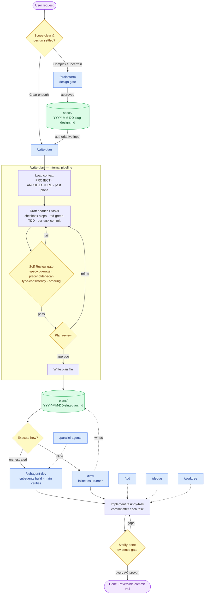

# Wyvrn superpowers harness — pipeline

End-to-end flow from a user request to a verified, reversible commit trail. Design gates
(`/brainstorm`, `/write-plan` Self-Review, `/verify-done`) bound each stage; artifacts
(`specs/`, `plans/`) persist the hand-off between stages.

## Legend

| Shape / color | Meaning |
|---|---|
| 🟦 Blue box | A skill you invoke (`/brainstorm`, `/write-plan`, `/subagent-dev`, `/flow`, `/tdd`, `/debug`, `/worktree`, `/parallel-agents`) |
| 🟨 Yellow diamond | A decision or **gate** — work cannot pass until the condition holds |
| 🟩 Green cylinder | A persisted **artifact** under `.claude-wyvrn-local/` (the hand-off between stages) |
| 🟪 Purple stadium | Entry / exit |
| Dotted arrow | Optional / supporting feed (e.g. `/flow` writes a learning log back to `plans/`) |

## Notes

- **Brainstorm is optional.** Clear, settled requests skip straight to `/write-plan`; `/write-plan` is standalone and does not require a spec.
- **Three gates enforce quality:** the `/brainstorm` spec approval, the `/write-plan` Self-Review (4 checks, run *before* you see the plan), and `/verify-done` (maps every acceptance criterion to observed proof).
- **Reversibility** comes from the plan's per-task commit discipline — each task ends in a self-contained `git commit`, so the trail is checkpointed at task granularity.
- **Executor handoff:** every generated plan opens with a `REQUIRED SUB-SKILL` line pointing the implementer at `/subagent-dev` or `/flow`.
